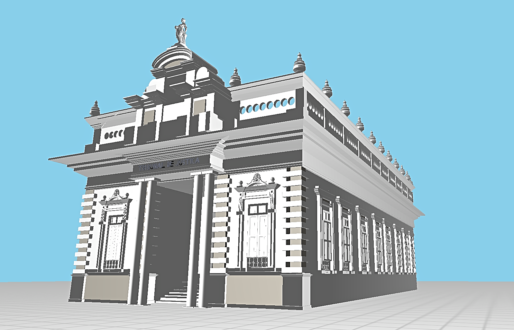
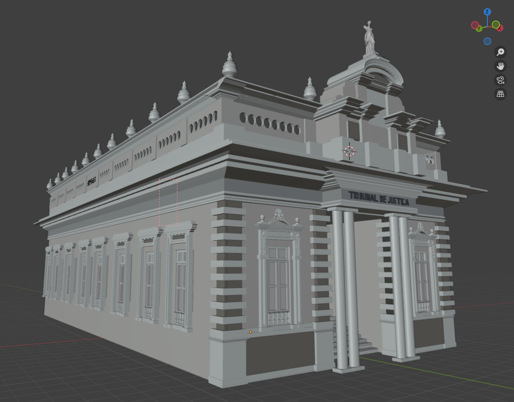

# Modelagem TJAL - CG UFAL

**Equipe**: Marcos Melo dos Santos, Felipe Gabriel Marques dos Santos, Clauderlan Batista Alves

## Renderização



## Modelo Blender



**Disciplina**: Computação Gráfica


## Resumo


Um visualizador simples de OpenGL para modelos glTF (.gltf/.glb) com controles de câmera, interação com portas e piso procedural.

Os modelos foram construídos utilizando blender a partir de formas geométricas tridimensionais como cubos e cilindros, além de técnicas de extrusão e chanfro para superfícies irregulares.

## Compilar

Requisitos: g++, GLFW, GLEW, OpenGL 3.3, pthreads. Em Debian/Ubuntu, instale pacotes como `libglfw3-dev` e `libglew-dev`.

```bash
make
```

## Executar

O programa procura o modelo em `models/TJAL.gltf` (com o binário `models/TJAL.bin`). Também funciona com `.glb`.

Se você tiver o arquivo compactado `models/tjal-cg.zip`, primeiro descompacte dentro da pasta `models/` para gerar `TJAL.gltf` e `TJAL.bin`:

```bash
unzip models/models.zip -d models
```

Depois, execute:

```bash
make run
```

## Controles
- WASD: mover
- Setas: olhar ao redor
- E: alternar porta mais próxima
- T: alternar textura do piso
- F11: alternar tela cheia
- Esc: sair

## Observações sobre assets grandes
- Não versionar binários grandes (`*.bin`, `*.glb`) no GitHub (limite de 100MB). Mantenha-os localmente em `models/` ou use Git LFS se precisar versioná-los.
